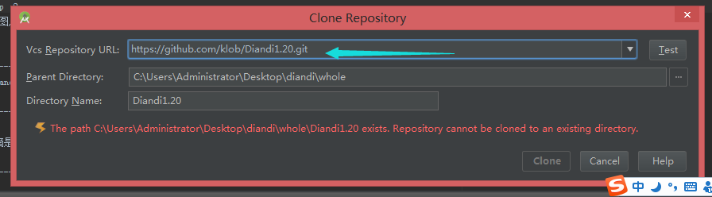
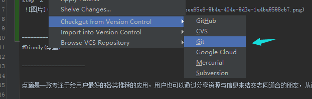
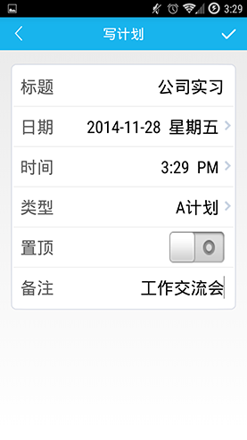

-------------------
**一** .how to run it

Method 1

step  1
　
step  2

　

Method 2

download the zip and import it by android studio
注：仅可用android studio 运行
-------------------

#Diandy(点滴)

---------------------

点滴是一款专注于给用户最好的各类推荐的应用，用户也可以通过分享资源与信息来结交志同道合的朋友，从而促进大家共同进步。

---------------------

Diandy For Android，为你翻开新的一页。

### 体验地址: [官网](http://diandi.bmob.cn/) [应用下载](http://diandiyun.oss-cn-beijing.aliyuncs.com/release/diandi.apk) ###

### 预览

　

### 感谢以下库作者和组织

####功能
*	[Bmob for android](http://www.bmob.cn/) 比目云后台
*	[Bmob IM](https://github.com/bmob/BmobIMSDK4Android) 比目的即时聊天源码
*	[Wonderful](https://github.com/bmob/Wonderful2) 猿圈媛圈开发团队的图文社区源码
*	[BaiduMap](http://developer.baidu.com/map/index.php?title=首页) 百度地图定位
*	[Umeng](http://www.umeng.com/) umeng更新与反馈模块

####框架
*	[ormlite-android](https://github.com/j256/ormlite-android) j256/ormlite-android
*	[Android-Universal-Image-Loader](https://github.com/nostra13/Android-Universal-Image-Loader) nostra13的Android-Universal-Image-Loader
*	[ASimpleCache](https://github.com/yangfuhai/ASimpleCache) yangfuhai的ASimpleCache 

####控件
*	[PullZoomView](https://github.com/Frank-Zhu/PullZoomView) Frank-Zhu的PullZoomView
*	[PhotoView](https://github.com/chrisbanes/PhotoView) chrisbanes的PhotoView
*	[DragLayout](https://github.com/BlueMor/DragLayout)BlueMor的DragLayout
*	[FloatingActionButton](https://github.com/makovkastar/FloatingActionButton) makovkastar的FloatingActionButton
*	[JumpingBeans](https://github.com/frakbot/JumpingBeans)frakbot的JumpingBeans 
*	[datetimepicker](https://github.com/flavienlaurent/datetimepicker)  flavienlaurent的datetimepicker 
*	[PagerSlidingTabStrip ](https://github.com/yangfuhai/ASimpleCache) astuetz的PagerSlidingTabStrip 

###说明：
整个项目只有我一个人在做，没有设计师，界面很丑，请大家原谅了。
在这里，也希望找几个小伙伴，一起把它做下去，有设计师最好了。

如果出现错误或者有任何问题，请放轻松联系我[kloblic@gmail.com](mailto:kloblic@gmail.com)，或者前往我的博客[csdn](http://blog.csdn.net/qq4626791047/article/details/41594821)提问

###关于我：
我是个华科在读的一个穷学生，痴迷开发，擅长Android，如果您手头有适合我的实习或者工作机会，欢迎邮件联系我[kloblic@gmail.com](mailto:kloblic@gmail.com)。

*	我的邮箱：kloblic@gmail.com
*	我的博客：[csdn](http://blog.csdn.net/qq4626791047?viewmode=contents)

欢迎Follow，欢迎合作

